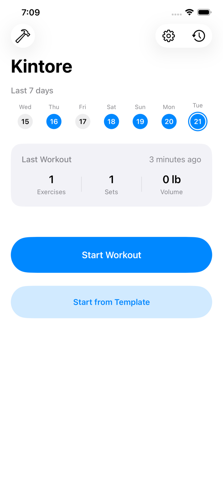
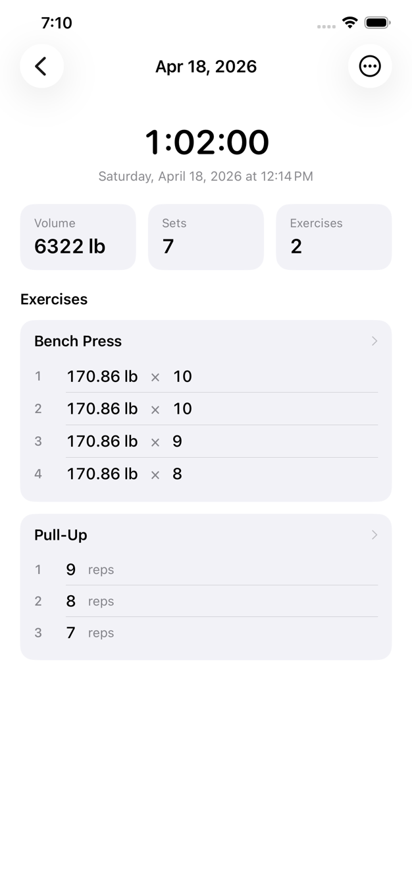
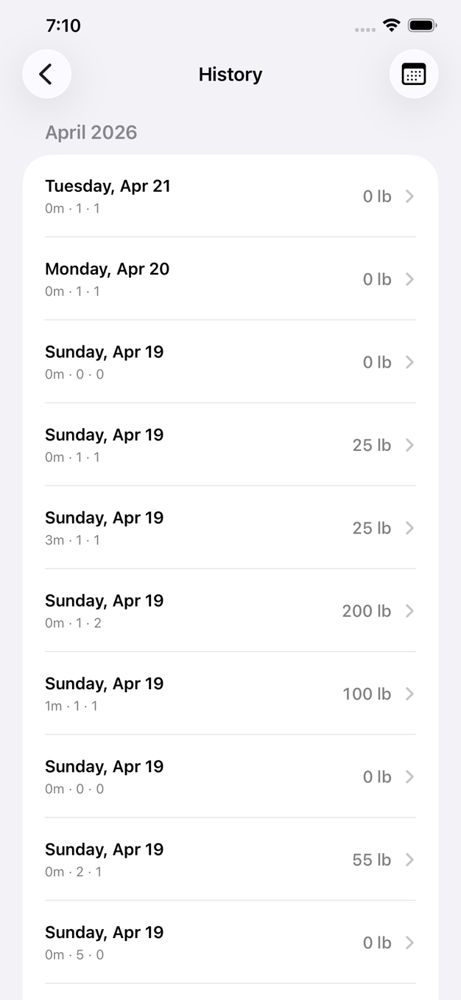

# Kintore

**A local-only workout logger for iOS. Log a set in about five seconds.**

No account, no cloud, no subscription — your training data never leaves your iPhone.

[Download on the App Store](https://apps.apple.com/app/id6762633868)

  

## What it does

- Last session's weight and reps pre-filled, so you know what to beat
- Built-in templates: Push / Pull / Legs / Upper / Lower / Full Body, plus your own
- ~60–80 seeded exercises across barbell, dumbbell, machine, bodyweight and cardio
- Session summary: sets, volume, duration, personal records
- Rest timer with background notification
- kg / lb switch
- Five languages: 繁體中文, 简体中文, English, 日本語, 한국어

## What it does not do

No accounts. No server. No social feed, coach, diet tracking or streaks. Your database is a local SQLite file on the device, so your own device backup is what protects it.

## Open source

Kintore is open source under the MIT licence.

- [Source on GitHub](https://github.com/keihong0213/GymFlow)
- [Report a bug or request a feature](https://github.com/keihong0213/GymFlow/issues)
- [Privacy Policy](./privacy.html)
